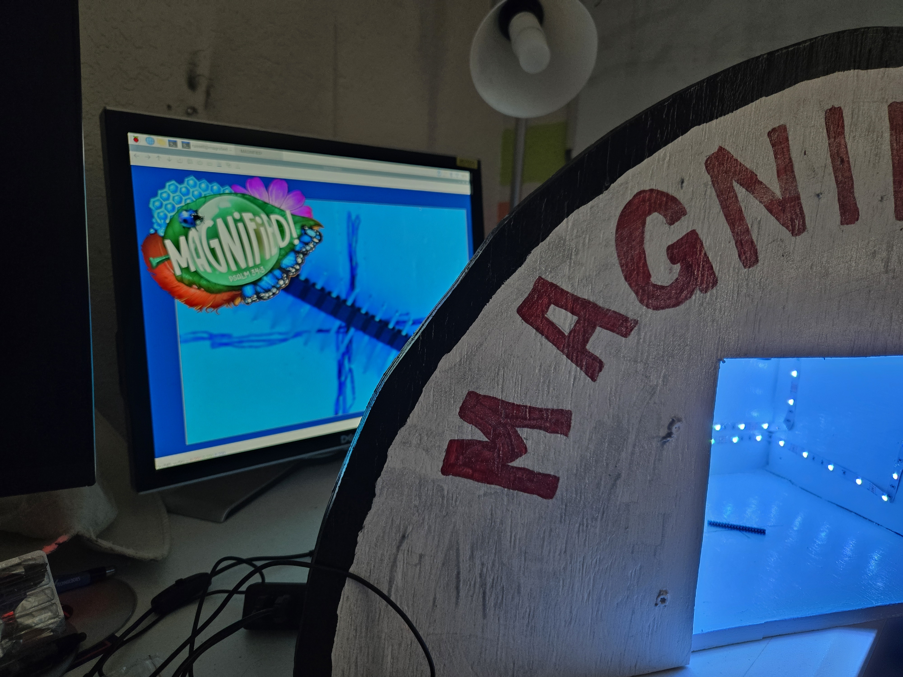

# magnified34_3
Pi driven magnifier for Magnified! VBS

I used a Raspberry Pi 4.  The Pi Zero was too lightweight.  I built the box, lit it with LEDs and mounted the camera on the underside of the top.  Kids can put whatever they want onto the stage and it will be projected on the TV screen.
